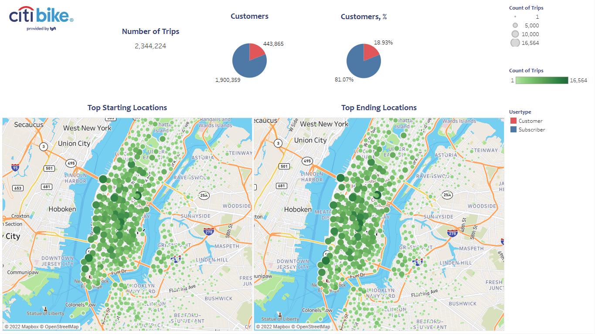
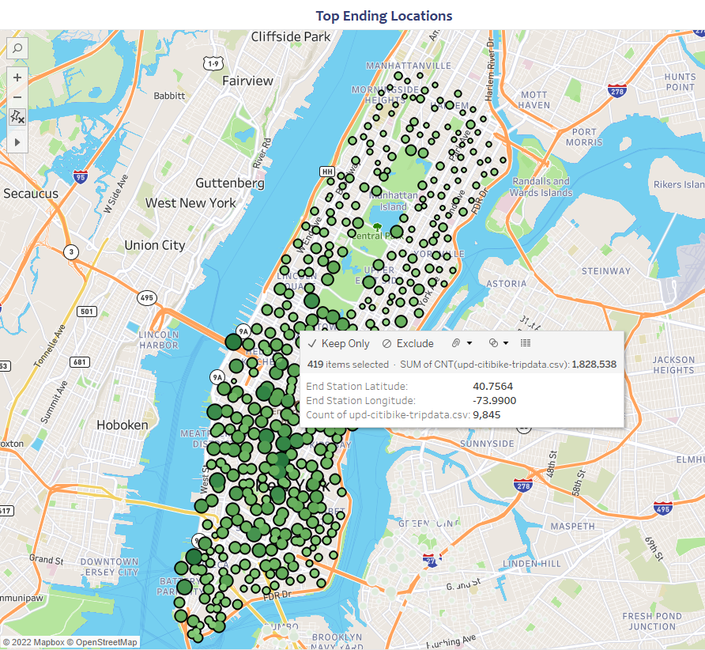
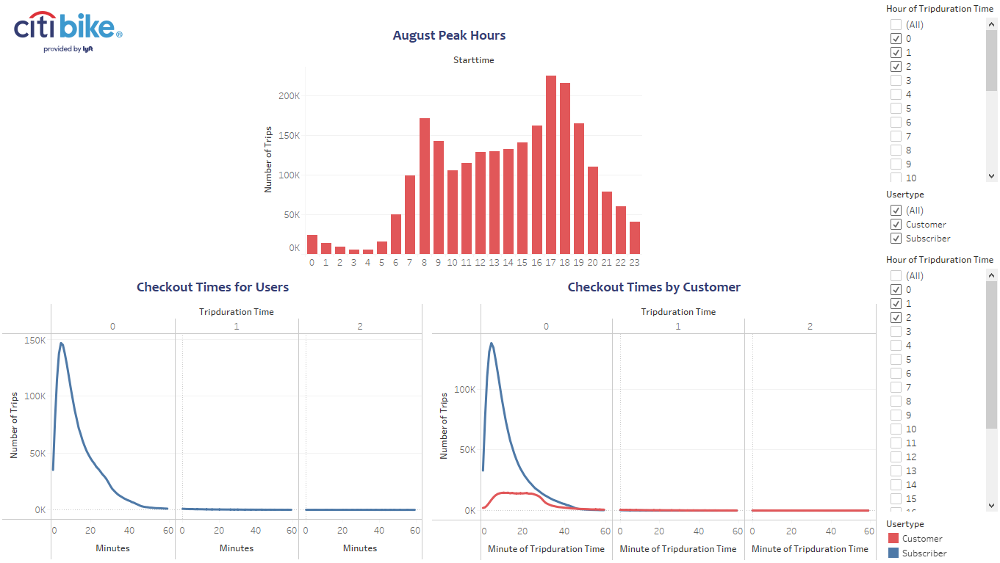
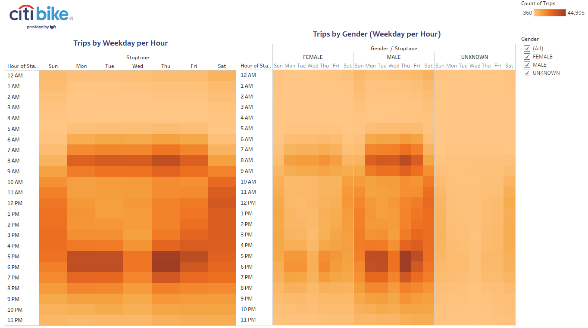
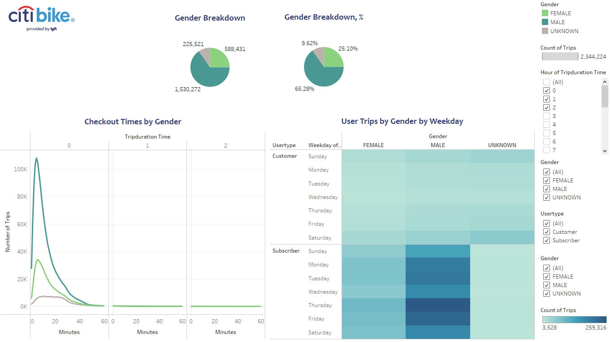
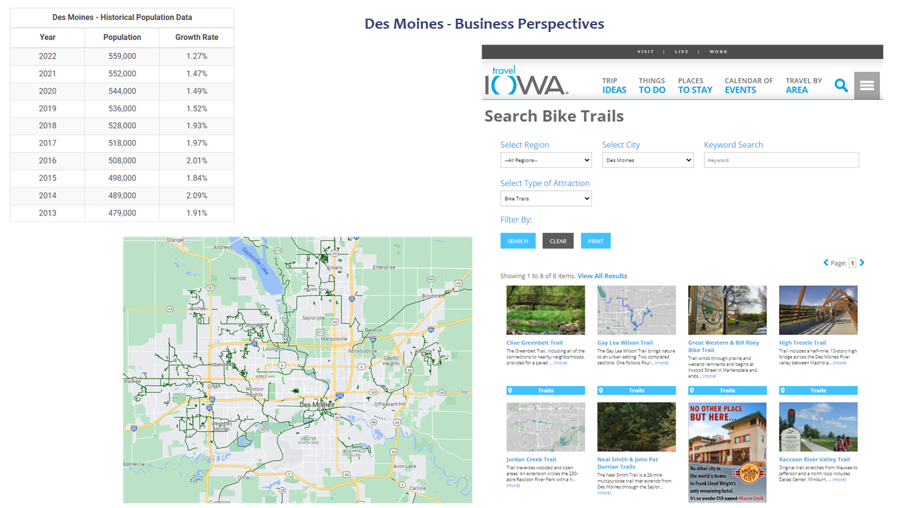

# Bikesharing

## Overview of the analysis

This analysis determines the summary overview for CitiBike data. CitiBike is a bicycle sharing system in New York City, NY. Data for analysis provided for month of August. Final results will help investors to make a decision if an idea to open a similar bike sharing business in Des Moines, IA is worth their money. Final visualizations of the analysis were prepared using Tableau Public tool.

## Results

Let's have a look on the results of the overview of CitiBike data below. For this analysis we took data from August because there is likely more traffic during the summer months.

There were more than 2 million trips in August with CitiBike. From the above screenshot we can see that top starting and ending locations are similar and located in Manhattan - the main touristic and business center in NYC.

Tableau allows us to select interested area so we can see that there were 1.8 million trips just in Manhattan.

81% of all CitiBike users - are annual subscribers (1.9 million), and only 19% - one-time customers (0.4 million). It follows that the majority of CitiBike users use bicycles for daily purposes. So let's check it more detailed.

Bicycles are used most often during peak hours - 8 am and between 5-6 pm. Also trip duration time for majority of users is around 5 minutes. If we check trip duration time with a breakdown on annual subscribers and one-time customers, we can see that customers use bicycles 10-25 minutes while peak usage time for subscribers is around 5 minutes. This proves that majority of users of CitiBike are regular citizens using bikes to avoid traffic and get to work. Tourists use bikes to enjoy the city view for a longer period of time, but again, it's only 19% of total bike trips.

Here we can see that during business days hot hours for CitiBike are morning and evening peak hours - 7-9 am and 5-7 pm. During weekends - it is a period of time from around 10 am to 7 pm. It's also interesting how people prefer not to use bikes that often on Wednesday - there is an obvious bright band on the graph, especially during evening peak hours.

Looking on a breakdown by gender we can see that men use bike sharing a way more often during both - business days and weekends.

We can also assume that majority of users who prefer not to share their gender are one-time customers since there are very few trips during business days peak hours. But let's check this assumption next.

Here we can get to know CitiBike users better: 65% - men, 25% - women, 9.6% - prefer not to share their gender. On the trip duration time we can see that users with unknown gender ride bicycles in average 10-25 minutes - the same trend as for one-time customers from previous screenshots.

Also, if checking user trips by gender by weekdays - male subscribers are the most active users during the whole week; majority of one-time customers - users who prefer not to share their gender.

Thinking about bike sharing business perspectives in Des Moines we can start the analysis with checking city population, bike trails availability in the city and in the around areas.

As of 2022 population of Des Moines is 559,000 and based on last 10 years it keeps growing. It is not that huge as in Manhattan but on the other hand - Des Moines will need less park of bicycles and will require less maintenance.

There are a lot of bicycle roads in the city and also [Iowa Travel](https://www.traveliowa.com/aspx/search_paged.aspx?srch=&nid=3&snid=447&ctlist=721) gives few nice bike trails for weekend activity and tourism.

Since CitiBike in NYC is very popular beyond regular citizens let's take a look on Des Moines from this point of view. From the Wikipedia:

>Des Moines is a major center of the US insurance industry and has a sizable financial services and publishing business base. The city was credited as the "number one spot for U.S. insurance companies" in a Business Wire article and named the third-largest "insurance capital" of the world. The city is the headquarters for the Principal Financial Group, Ruan Transportation, TMC Transportation, EMC Insurance Companies, and Wellmark Blue Cross Blue Shield. Other major corporations such as Wells Fargo, Cognizant, Voya Financial, Nationwide Mutual Insurance Company, ACE Limited, Marsh, Monsanto, and Corteva have large operations in or near the metropolitan area. In recent years, Microsoft, Hewlett-Packard, and Facebook have built data-processing and logistical facilities in the Des Moines area.

Regarding public transportation:

>Des Moines's public transit system, operated by DART (Des Moines Area Regional Transit), which was the Des Moines Metropolitan Transit Authority until October 2006, consists entirely of buses, including regular in-city routes and express and commuter buses to outlying suburban areas.

Des Moines is also a business center although not that huge as Manhattan. And since there are only buses as public transportation there might be high demand on bicycles as an alternative transportation.

## Summary

After reviewing the CitiBike data in NYC we can see that:
- Majority of CitiBike users - annual subscribers (81%);
- Top trips - Manhattan area during peak hours (8am and 5-6pm) with average trip duration of 5 mins;
- One-time customers use bikes longer - time interval 10 - 25 mins;
- Men are the most active users.

After reviewing Des Moines we can see that:
- Population is growing every year;
- Des Moines is a major center of the US insurance industry, strong business center;
- There are a lot of bike trails in the city and in around areas;
- Public transport is represented only by buses which makes bicycles a wonderful alternative transportation.

Although population of Des Moines is not that high as Manhattan - it is growing every year bringing more and more potential customers. This is a plus for a new business - it is not required to have that huge park of bicycles in the beginning and also it will require less maintenance. So, it won't require huge investments to start the business.

Bike sharing might be popular among regular citizens of Des Moines since it has a lot of bike trails in the city, it is a big business center and it has only buses as a public transport. And bike sharing might be popular among active tourists as well with a lot of interesting bike trails in around areas of the city.

It would be interesting to see how many users use CitiBike by their unique id. It would be possible to combine the whole route during the day to see popular routes. And it would also give an idea of a monthly revenue based on quantity of annual subscribers since there is a fix price for them.

It would be also interesting to see the dependence of bicycle use from the user's age. Checking this information and median age in Des Moines could give an idea how popular this business will be there.

Please see the Tableau Public visualization [here](https://public.tableau.com/app/profile/liliia.strukova/viz/BikeSharingProgram_16478275434390/BikeSharingProgram).